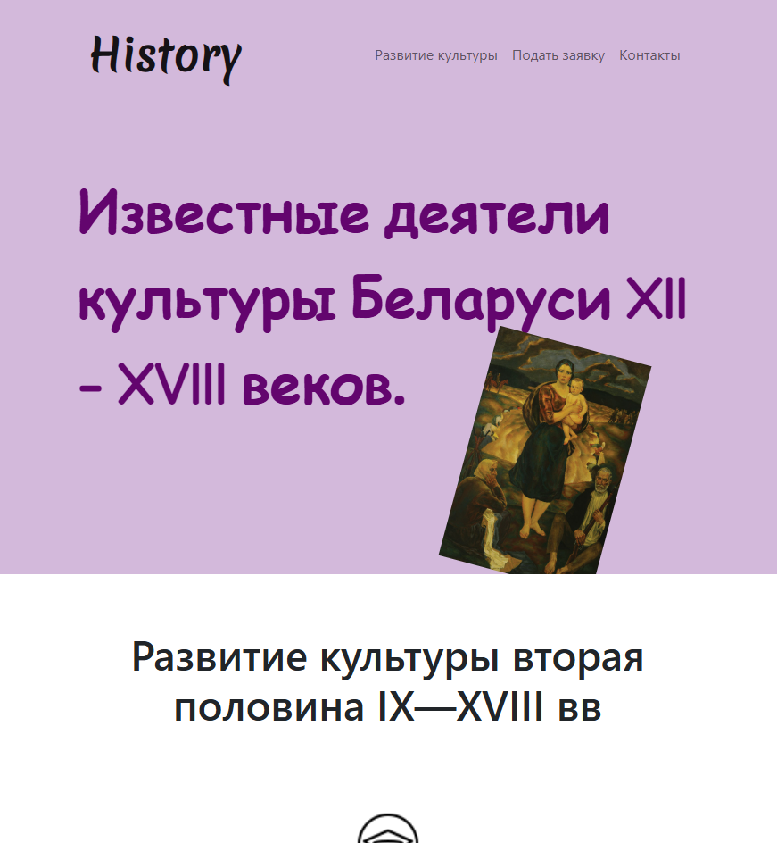

# Pet-progect_History_Website

##🌟 "History and Culture of Belarus: 12th-18th Centuries"
A web project created for artistic and educational immersion into the era of outstanding cultural figures of Belarus. Designed as a one-page site in purple and white colors with expressive accents.

##🧩 Main idea:
To introduce users to the personalities who defined the cultural heritage of Belarus through visual images, laconic signatures and aesthetically designed navigation.

##⚙️ Technologies:
- HTML, CSS — manual styling without frameworks.
- Adaptive design — readable on different devices.

## Screenshots

